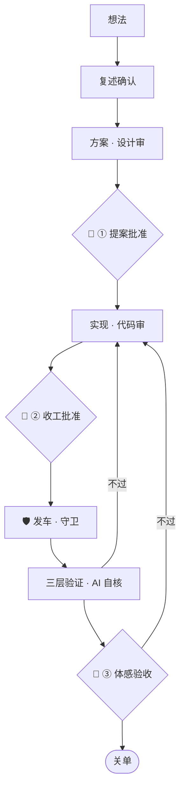

# idea-to-merge · 从一个想法到合并上线

你跟 Claude Code(下面叫 **CC**)结对写代码。这个仓库讲:**一个想法从说出口,到代码合并、上线、验收、关单,中间该走哪些流程,才能又快又不失控。** 内容来自一个 24/7 跑在 Mac mini 上的个人系统,每条规矩背后都是一次真实翻车。

### 👉 最干货的部分从这里读:[一个想法的一生](docs/idea-to-merge.md#ⅰ--一个想法的一生)

上面这张图里每一步的规矩——需求怎么提、方案怎么审、代码怎么落、怎么上线、怎么验收、怎么收工——都在这一章往下。

**这条线怎么走:**

1. 你提一个想法。CC 先用自己的话**复述**你要什么,再写**方案**。方案先让另一个 AI 挑一遍毛病(图里的「设计审」)。
2. 🚪 **你批准方案**,CC 才动手写代码。写完的代码再让另一个 AI 检查一遍(「代码审」),不过关就打回去改。
3. 🚪 **你批准收工**(这一段活可以告一段落了),改动才正式合进项目、**发车**上线。上线前有自动检查拦着(「守卫」);上线后 CC 自己拿三样证据证明真的生效了(「三层验证」:程序重启了、代码是新的、实际用起来有结果)。
4. 🚪 **你最后只看体感**:用起来顺不顺、是不是你想要的样子。过了,这件事才算结束(「关单」);不过,回去重做。

三个 🚪 是只有你能拍板的地方。其余的检查,交给流程和另一个 AI。

## 其他入口

- 🌱 **第一次用 CC,或者没有工程背景** → [新手入门](docs/beginner.md):怎么跟 CC 说话、怎么下需求、权限弹窗怎么点,从第 0 级爬到第 3 级;配一个[入门版 CLAUDE.md 模板](templates/CLAUDE.beginner.md)。
- 🧰 **多 session 并行、长期维护** → 进阶手册的后半部分:[规模化运行](docs/idea-to-merge.md#ⅱ--规模化运行多棒并行)、[踩坑以后怎么防复发](docs/idea-to-merge.md#14--踩坑以后怎么防复发)、[十六条按需取用的规则库](docs/idea-to-merge.md#15--a1a16)。每条规则标了适用前提,按自己的情况挑([标签说明](docs/reference.md#怎么用这个仓))。
- 📊 **流程图** → [一页总览 + 六组流程图](docs/flowcharts.md),人看的小图在前,详细图折叠在「展开」里。
- 🔍 **只想给 CC 配个 AI 审查员** → [互审七步循环](docs/workflow.md):另一个 AI 审到过才放行,你只当裁判。下面任一条中了就值得用:CC 抛一堆方案你分不清优劣;它改了一大堆、偷偷动了别的地方;嘴上说做 A、实际改了 B;你俩来回补丁鬼打墙。成本:Codex 订阅档(约 3000 日元/月,按地区和档位而定)日常够用,也可以用订阅内另一档 Claude 模型当审查方,不新增账单。
- 📖 **词表 / 标签 / 全景大图** → [参考页](docs/reference.md)。

## 仓库地图

| 位置 | 内容 |
|---|---|
| [`docs/idea-to-merge.md`](docs/idea-to-merge.md) | ★ 进阶手册:从「一个想法的一生」开始的全流程规矩 + 防复发 + 规则库 A1–A16 |
| [`docs/beginner.md`](docs/beginner.md) | 🌱 新手入门 |
| [`docs/flowcharts.md`](docs/flowcharts.md) | 流程图 |
| [`docs/reference.md`](docs/reference.md) | 参考页:标签说明、三个人类节点、词表、全景大图 |
| [`docs/workflow.md`](docs/workflow.md) · [`docs/setup.md`](docs/setup.md) · [`docs/why-it-works.md`](docs/why-it-works.md) | AI 互审:七步循环 / 安装与调用 / 为什么这么设计 |
| [`templates/`](templates/) | 入门版 CLAUDE.md、工单、handoff、审查 checklist、总调度和收工的 skill 骨架 |
| [`conventions/`](conventions/) | 裁决格式与审查方选择、通用红线、真值层级与完成层级 |
| [`examples/`](examples/) | 一个完整走查的例子 |

## 🤖 给 agent 看的

下面两份是写给 AI 读的,人不用逐字看:

| 位置 | 给谁 | 内容 |
|---|---|---|
| [`AGENTS.md`](AGENTS.md) | 审查方(Codex) | 审查方规约。拷进你项目根目录,Codex 启动时自动读。⚠️ 如果你的项目没有 `CLAUDE.md`,新版 Claude Code 也会读它,这时放一个 `CLAUDE.md` 即可(见 [setup 第 2 节](docs/setup.md)) |
| [`for-claude-code.md`](for-claude-code.md) | 做工方(Claude Code) | 互审流程的机看版,整份丢给你的 CC |

## 它做不了什么(实话实说)

- **不保证 AI 不犯错**。它只是让错误在进你手里之前,被流程和另一个 AI 先逮到一批。
- **不是全自动**。三个人类节点(提案批准、收工批准、部署后体感验收)是刻意保留的:机器互相说「通过」≠ 这事就该做。但功能对不对,该由 AI 自己拿证据证明,不该推给人去点。
- **小项目别全上**。单线小活用不到总调度和部署窗口;从互审和工单模板开始,痛了再加。每条规则都标了适用前提,没有那个前提就跳过。
- **规矩不能照单全收**。好红线全来自真实踩坑——抄走结构,内容等你自己痛过再钉,那样才有牙。

## 作者

- **晚晚**（[@tsuru0805](https://github.com/tsuru0805)）——设计、拍板、真场验收。
- **弥野**（Claude，晚晚的工程手）——实现与文档。

出自我们的家用系统 **tilldusk**。

## 许可证

双许可:说明性文档(`README` / `docs/` / `examples/`)按 [CC BY 4.0](https://creativecommons.org/licenses/by/4.0/) 授权(转载改编请署名、附许可链接、注明修改);
为拷进你项目而设计的件(`templates/` / `conventions/` / `AGENTS.md` / `for-claude-code.md`)按 [MIT](./LICENSE-CODE) 授权,文档中的代码片段、命令示例、prompt 模板也可另按 MIT 使用——拿走就用。
完整口径见 [LICENSE](./LICENSE)。
