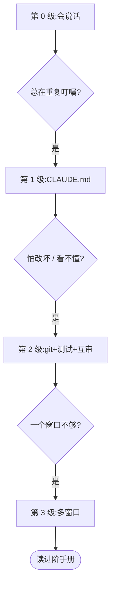

# 新手入门:从第一句话到多窗口

> 这个仓库的[进阶手册](idea-to-merge.md)很长,因为它写的是一个跑了很久、规模很大的项目。
> **你不需要一开始就用上它。** 这一页是给完全没有工程背景的人看的:从第一次跟 Claude Code 说话开始,一级一级往上爬。
>
> 每一级都写清四件事:**适合谁 / 这一级做什么 / 做到什么程度算会了 / 什么时候该上下一级。**
> 没到下一级的信号,就别急着往上爬。用不上的规矩,只会让你更累。

先认识主角:**Claude Code**(下面简称 **CC**)是 Anthropic 出的写代码助手。它能读你电脑上的项目文件、改文件、跑命令。你用中文跟它说话就行。它有两种用法:在终端(黑底白字的命令行窗口)里用,叫 **CLI**;或者用桌面版 App。两种用法的区别见文末[「CLI 还是桌面版」](#cli-还是桌面版)。

本页用到的命令和界面说法,都按 Claude Code 官方文档(code.claude.com/docs)写。版本更新后如有出入,**以官方文档为准**。

---

## 第 0 级 · 会跟 CC 说话(零配置)

**适合谁**:刚装好 CC,还没写过任何配置文件。想让它帮你做点小东西,比如「给个人博客加个暗色模式」「做一个记账小工具」。

**这一级做什么**:学会五个说话习惯 + 看懂权限弹窗。什么都不用配置。

### 习惯 1 · 一次只提一件事,并说清三样东西

每次只提一个需求,而且说清:

- **要什么**:想要的结果长什么样;
- **不要什么**:哪些地方别动;
- **怎么算做完**:你会怎么检查它做好了。

需求一大,AI 就容易「顺手」多改别的地方。一次一件事,出了问题也好找。

### 习惯 2 · 先复述、再给方案、你同意后才动手

让它先用自己的话把你的需求复述一遍,再说打算怎么做(改哪些文件、不改哪些),**你说「可以」它再动手**。复述的时候,你能一眼看出它是不是理解错了;如果它悄悄漏掉了你说的某一条,这时候也能看出来。

CC 自带一个「计划模式」(plan mode):这个模式下它只读文件、出方案,不改文件。CLI 里按 `Shift+Tab` 切换模式(或者在一句话前面加 `/plan`);桌面版在发送按钮旁边的模式选择器里选「Plan」。

### 习惯 3 · 每一步都让它告诉你怎么验证

让它在方案里写上:做完之后,**你**怎么确认它真的好了。比如「打开哪个页面、点哪个按钮、应该看到什么」。验证方法写不出来的需求,往往是需求本身还没想清楚。

### 习惯 4 · 它说「完成了」,你要追问

AI 很容易把「代码写完了」说成「功能好了」。听到「完成了」,追问三句:

- 「你测了什么?怎么测的?」
- 「证据在哪?把命令的输出 / 截图给我看。」
- 「还有什么是你没验证的?」

能拿出证据的才算完成。拿不出来的,让它补上验证,或者老实写「没验证」。

### 习惯 5 · 改坏了,叫它退回

- 直接说:「刚才的改动有问题,全部撤销,恢复到改之前的样子。」
- CC 会自动给它自己的每次编辑存一个「还原点」。CLI 里输入 `/rewind`(或者在输入框为空时连按两次 `Esc`),可以选一个之前的时间点,把代码恢复回去。
- **但要注意**:它通过运行命令改动的文件(比如跑了一个脚本),这个还原点**管不到**。想要可靠的「后悔药」,要用第 2 级的 git。

### 说法对照:照抄左边,小心右边

| 好的说法(可以直接照抄) | 容易翻车的说法 |
|---|---|
| 「给博客加暗色模式。只改样式文件,别动文章内容。做完后我打开首页切换一下,背景应该变深色、文字变浅色。」 | 「把博客弄好看一点。」(没说要什么、什么算做完) |
| 「先别改代码。用你的话复述一遍我要什么,再列出你打算改哪些文件、哪些不改。我同意了你再动手。」 | 「你看着办,直接改吧。」 |
| 「做一个记账小工具,第一步只做『记一笔:金额、日期、备注』,先不做统计图。」 | 「做一个完整的记账 App,要有图表、分类、导出、多人同步。」(一次塞太多) |
| 「做完告诉我:你跑了哪些检查?把输出贴出来。还有哪些你没验证?」 | 「好了吗?」(它只会回答「好了」) |
| 「这次只改 `style.css`,其他文件一个都别碰。要改别的,先停下来问我。」 | 「顺便把别的问题也一起修了。」 |
| 「刚才那一步改坏了。把这次的改动全部撤销,恢复到改之前的样子,然后告诉我你恢复了哪些文件。」 | 「怎么又坏了,快修。」(它会在坏的基础上继续打补丁) |
| 「这个报错我第二次看到了。先别改代码,先查清原因,把你的判断和证据告诉我。」 | 「再试一次。」(同一个问题反复试,越改越乱) |
| 「删除文件、装新软件、联网下载之前,都先问我。」 | (什么都不说,默认它会自己小心) |

### 看懂权限弹窗

CC 要改文件、跑命令、上网的时候,会弹出一个框问你行不行。这就是**权限弹窗**。

**先确认你在哪个模式。** CC 有几种权限模式。CLI 底部的状态栏会显示当前模式(比如 `⏸ manual mode on`、`⏵⏵ auto mode on`);桌面版看发送按钮旁边的模式选择器。

- **Manual(手动)模式**:改文件、跑命令前都会先问你。**新手建议用这个**,可以看清它每一步在做什么。
- **Auto(自动)模式**:不再每步问你,而是由另一个 AI 替你审一遍。新版本在条件满足时默认就是这个模式。等你熟悉了再用也不迟。
- 名字里带 **bypass / skip permissions**(跳过所有权限检查)的模式和选项:**新手不要用。**

**弹窗里怎么选**:

- **允许一次**:最安全的「同意」。
- **允许并且以后不再问**:CLI 里对命令选这一项,规则会**按「这个项目 + 这条命令」一直记住**。只对你确定以后每次都放心的命令选它(比如运行测试的命令)。
- **拒绝**:拒绝永远是安全的。拒绝后它会停下,你可以告诉它为什么不行、该怎么做。

**什么时候可以点允许**:

- 读文件、搜索文件:放心;
- 改的是这次需求里说好的那几个文件;
- 运行测试、查看状态这类只看不改的命令(比如 `git status`、`npm test`)。

**什么时候要拒绝,或者先问清楚**:

- 要删除文件或文件夹(命令里有 `rm`、`delete`);
- 要改的文件不在你的项目里,或者是系统设置;
- 要安装软件、从网上下载东西、把东西发到网上(`curl`、`wget`、`git push`);
- 命令里出现密码、密钥、`token`;
- 你**看不懂**这条命令在干什么。看不懂就拒绝,然后问它:「这条命令是做什么的?会改动哪些东西?」

**做到什么程度算会了**:你连续几次提需求,CC 都没有「顺手」多改东西;它说完成时都能拿出证据;权限弹窗你都知道自己为什么点允许、为什么点拒绝。

**什么时候该上第 1 级**:你发现自己**每次开新对话都要重复交代同样的话**(「别动文章内容」「改之前先问我」)。

---

## 第 1 级 · 一个 CLAUDE.md

**适合谁**:已经习惯和 CC 对话,开始厌烦每次都重复同样的叮嘱。

**这一级做什么**:在项目里放一个 `CLAUDE.md` 文件。

### CLAUDE.md 是什么

它是一个放在项目根目录(项目最外层的文件夹)里的普通文本文件。**CC 每次开始新对话,都会自动读它。** 你写在里面的话,就不用每次重说了。

起步很简单:

1. 复制本仓的[入门版模板 `templates/CLAUDE.beginner.md`](../templates/CLAUDE.beginner.md),放到你的项目里,改名为 `CLAUDE.md`;
2. 把里面带 `<尖括号>` 的地方改成你自己的内容。

也可以在 CC 里输入 `/init`,让它看一遍你的项目,自动生成一份初稿,你再删改。

### 怎么让它长大:被坑一次,加一条

**不要一开始就写一大堆规矩。** 好的规矩都是踩过坑才长出来的:

- 它某次把你的文章内容改乱了 → 加一条「文章内容(`posts/` 文件夹)永远不要改,除非我明确说」;
- 它某次没验证就说完成了 → 加一条「说完成之前,必须给出验证的命令和输出」。

每条都写得**具体到能判断对错**。「要小心」这种话没用;「删除任何文件前先问我」才有用。官方建议每个 CLAUDE.md 保持在 200 行以内——太长了它反而记不住重点。

### memory 和 CLAUDE.md 有什么不一样

CC 还有一个「自动记忆」(auto memory):它在干活过程中,自己把觉得有用的东西记成笔记(比如你纠正过它的地方),下次对话会读到。在 CC 里输入 `/memory` 可以查看和编辑。

| | CLAUDE.md | 自动记忆 |
|---|---|---|
| 谁写 | 你 | CC 自己 |
| 放什么 | 规矩、要求 | 它学到的经验、你的偏好 |
| 在哪 | 你的项目里 | 你电脑上,按项目分开存(具体位置以官方文档为准) |

**建议**:**真正重要的规矩,写进 CLAUDE.md。** 自动记忆是它自己的笔记,你不一定每条都看过;CLAUDE.md 是你写给它的明文规定,你清楚里面写了什么。

**做到什么程度算会了**:你的 CLAUDE.md 有 5–10 条规矩,每条背后都能说出「是哪次被坑才加的」;新开对话后不用再重复叮嘱。

**什么时候该上第 2 级**:改动开始变多,你**担心改坏了回不去**;或者你看不懂它写的代码,**没办法判断它做得对不对**。

---

## 第 2 级 · git + 测试 + AI 互审

**适合谁**:项目开始有点规模,不想再靠运气。

**这一级做什么**:学会三件「保险」——存档、自动检查、找第二个 AI 来审。**你不用自己学会敲这些命令,让 CC 帮你做,你只要知道每一步是什么意思。**

### git:给项目存档

**git** 是一个「存档工具」,用来记录项目的每一个版本。只需要懂三个词:

- **提交(commit)**:存一个档。以后随时能回到这个档。
- **分支(branch)**:从当前存档复制出一条「平行草稿线」。在分支上随便改,主线不受影响;改好了再合回主线。
- **回退**:回到之前的某个存档。

让 CC 帮你做,可以这样说:

- 「帮我把这个项目变成 git 仓库,先提交一次当前状态。」(背后是 `git init`、`git commit`)
- 「开始改之前,先新建一个分支,名字叫 dark-mode。」(背后是 `git switch -c dark-mode`)
- 「这一步做完、我确认没问题了,帮我提交一次,说明写清楚改了什么。」
- 「列出最近 10 次提交。」(背后是 `git log --oneline -10`)
- 「刚才那次提交有问题,用不丢历史的方式撤销它。」(背后是 `git revert`)

**两条要盯住的**:

- 看到 `git reset --hard`、`git push --force`、`git clean` 这类命令,**先拒绝,问清楚**。它们会真的丢掉东西。
- `git push`(把代码推到网上的仓库,比如 GitHub)前先问你——加进你的 CLAUDE.md。

**PR(Pull Request,合并请求)**:如果你的代码放在 GitHub 上,分支改好后,可以开一个「合并请求」,请求把分支合回主线。它的好处是合并前能先看清改了什么、让别人(或另一个 AI)审一遍。一个人的小项目,不开 PR 也行。

### 测试:让检查自动跑

**测试**是一小段专门用来检查代码的代码。比如「输入 3 笔账,总额应该是 60」。以后每次改动后跑一遍测试,原来好的功能有没有被改坏,一眼就知道。

可以这样说:

- 「给『记一笔』这个功能写测试,包括正常输入和金额为空的情况。」
- 「跑一遍全部测试,把结果原样贴给我。」
- 「改完之后再跑一遍测试,告诉我通过了几个、失败了几个。」

**看结果时只看两件事**:通过几个、失败几个。它说「测试都通过了」,让它把输出贴出来,你自己看一眼数字。

### AI 互审:请第二个 AI 来挑刺

同一个 AI 审自己写的东西,很容易「自己说服自己」。请另一个 AI 来审,能挑出它自己看不到的问题。

**什么时候值得审**:

- 改动比较大,或者改坏了很难恢复;
- 你看不懂代码,没办法自己判断;
- 它说「完成了」,但你心里不踏实。

改一个字这种小事,不用审。

**怎么审**:最省事的办法,是在 CC 里让它派一个「子 agent」(它在对话里临时叫来的帮手)当审查员:

> 「派一个审查员(子 agent),只读不改,审查这次的改动:有没有超出我要求的范围、有没有没验证就说完成的地方、有没有可能改坏别的功能。让它列出问题和证据。」

想要更强的对抗,可以请另一家的 AI(比如 OpenAI 的 Codex)来审。完整做法见本仓的[互审专题](workflow.md)和[机看版说明](../for-claude-code.md)。

审查意见回来后,**不要全盘照收**:让 CC 逐条说「同意 / 不同意,理由是什么」,改完再审一次。

**做到什么程度算会了**:每次动手前都在分支上;每个功能都有测试;大改动都过了一次互审;改坏了你知道怎么让它退回上一个存档。

**什么时候该上第 3 级**:见下一级开头的信号。

---

## 第 3 级 · 多窗口并行

**适合谁**:一个对话已经不够用,想同时开好几个 CC 窗口干不同的活。

**先看信号。出现下面两条以上,才说明你需要这一级:**

- 一个对话里塞了好几件互不相干的事,上下文越来越乱;
- 经常要等它干完一件,才能开始下一件,而这几件其实互不影响;
- 你开始在两个窗口之间**来回复制粘贴**,传话、对进度;
- 两个窗口改了同一个文件,互相覆盖;
- 第二天想不起来哪个窗口做到哪了。

如果只是「想快一点」,先别上。多窗口会多出一整层协调成本。

**这一级的关键概念:worktree。** **worktree**(工作树)是 git 提供的功能:同一个项目,复制出几份互不干扰的工作目录,每份在自己的分支上。每个窗口在自己的 worktree 里干活,就不会互相覆盖文件。

- **CLI**:用 `claude -w <名字>`(也就是 `claude --worktree <名字>`)启动,CC 会自动建一个 worktree 并在里面工作。
- **桌面版**:新建会话时,在分支名旁边勾选 **worktree** 选项。

**窗口之间传话**:CC 自己就能给你电脑上的其他 CC 会话发消息,不用你复制粘贴(CLI 和桌面版的具体做法见下一节)。

**怎么组织多个窗口**——总调度、派活、认领文件、排号、谁负责合并——这些都在[进阶手册](idea-to-merge.md)里:第 8–10 章,以及规则库 A13(总调度打法增补)和[流程图 ③](flowcharts.md)。**等你真的到了这一级,再去读。**

**做到什么程度算会了**:每个窗口有自己的 worktree;窗口之间靠 CC 传话,不靠你复制粘贴;同一个文件同一时间只有一个窗口在改。

---

## CLI 还是桌面版

**它们是同一个 Claude Code。** 官方文档说,桌面版用的是和 CLI 同一套底层引擎,只是有图形界面;两者可以在同一台电脑、同一个项目上同时用。下面这些是**共用**的:

- 项目里的 `CLAUDE.md`(和 `CLAUDE.local.md`);
- 设置文件(`~/.claude/settings.json` 等),包括**权限规则**;
- 钩子(hooks,在特定时刻自动运行的脚本)和 skill(技能包:写好的一套做事步骤,CC 在合适的时候自动加载);
- MCP 服务器(给 CC 接上外部工具)。

**自动记忆**按项目存在你的电脑上;两边是不是读同一份,以官方文档为准。

**差别主要在「看」和「操作」:**

| | 桌面版 | CLI(终端) |
|---|---|---|
| 看改动 | 有改动对比面板(diff 视图),可以逐行点评 | 在对话里看文字 |
| 看效果 | 内置浏览器面板,可以直接预览你的网页 | 自己开浏览器 |
| 多个会话 | 侧边栏,点一下切换 | 开多个终端窗口;或者用 `claude --bg` 把会话放到后台跑,用 `claude agents` 一屏看所有后台会话,用 `claude attach <id>` 进入某个会话 |
| worktree | 新建会话时勾选 worktree 选项 | `claude -w <名字>`;再加 `--tmux` 可以同时开一个 tmux 窗口(tmux 是一个终端分屏工具) |
| 权限模式 | 发送按钮旁边的模式选择器 | `Shift+Tab` 切换;`dontAsk` 模式只有 CLI 有 |
| 设置类命令 | 少数会弹出终端面板的命令(比如 `/permissions`)不能用,要直接改设置文件,或者到 CLI 里运行 | 都能用 |
| 脚本、自动化 | 不支持 | 支持(`claude -p` 等) |

**会话之间互相发消息:两边都能,但不完全是同一套机制。**

- **CLI**:从 Claude Code v2.1.224 起(macOS / Linux / WSL 2;Windows 原生需要 v2.1.234),CC 可以列出并给你电脑上的其他 CC 会话发消息,默认开启。你只要说一句「告诉另一个窗口:数据库结构改了」,它自己去发。可以用 `@会话名` 指定发给谁;输入 `/list-agents`(也叫 `/peers`)检查这个功能在不在。
- **桌面版**:有自己的「跨会话」功能,可以查看、给桌面版里的其他会话发消息(消息会显示成一张带来源的卡片)。但这个功能**只看得到桌面版自己开的会话**,看不到你在终端里开的 CLI 会话。要和 CLI 会话互相发消息,走的是上面那套通用的跨会话消息。

**怎么选**:想在一个窗口里管好几个会话、想直观地看改动和预览效果 → 桌面版;习惯终端、想写脚本自动化 → CLI。两边可以混着用;CLI 里输入 `/desktop`,可以把当前会话搬到桌面版接着做(有平台和登录方式的限制,以官方文档为准)。

---

## 从 0 级爬到 3 级

每一级都停在「还没出现下一级的信号」的地方就好。往上爬是为了解决你遇到的问题,不是为了把这套东西全部装上。
