# 流程图

> 两层:**给人看的**是开头的一页总览和每组前面的小图(节点少、字短);**给 agent / 想看细节的人**的是每组折叠起来的详细流程(六组,图 ③ 拆成两张子图),把[全景文档](idea-to-merge.md)里散在各章的流程画成一张张可以照着走的图。
> 用 Mermaid 写,GitHub 上直接渲染;本地看可以用任何支持 Mermaid 的编辑器预览。
>
> 读图约定:
> - **方框** = 动作;**菱形** = 判断,出边上写判断结果;
> - 🚪 = 人类节点(只有人能拍的地方);🛡 = 守卫(会拦人的检查);
> - **往回指的边** = 回退(审查打回、验收不过、守卫拦下),它们和主线一样重要——流程好不好,主要看回退边画没画全。
> - 某张图里的步骤如果你的项目没有(比如没有部署环节),整段跳过;各步骤的适用前提见[参考页](reference.md#怎么用这个仓)。

---

## 一页总览

先看这一张就够了;下面六组图,每组先给一张小图说「这张图在讲什么」,详细流程折叠在「展开」里。

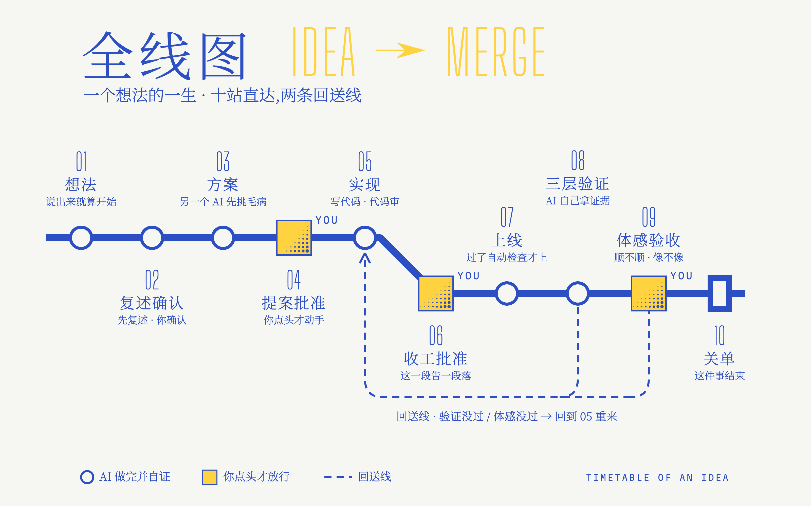

这张图的文字版(给 agent / 读屏)

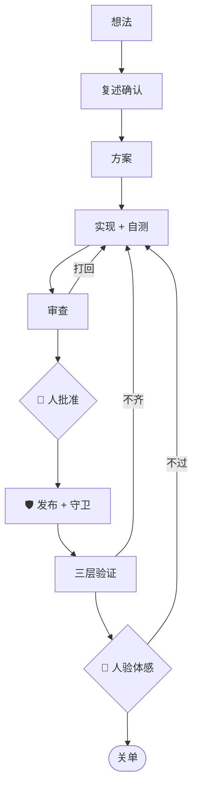

- **三个回退**:审查打回、三层验证不齐、人验体感不过,都回到实现。
- **两个人类节点**画在这里;完整版里还有提案批准、发车许可等,在下面的详细图里。

---

## ① 总览:从想法到关单

这张图讲:一个想法从提出到关单,中间有三个人类节点,每一道审查都可能把活打回去。

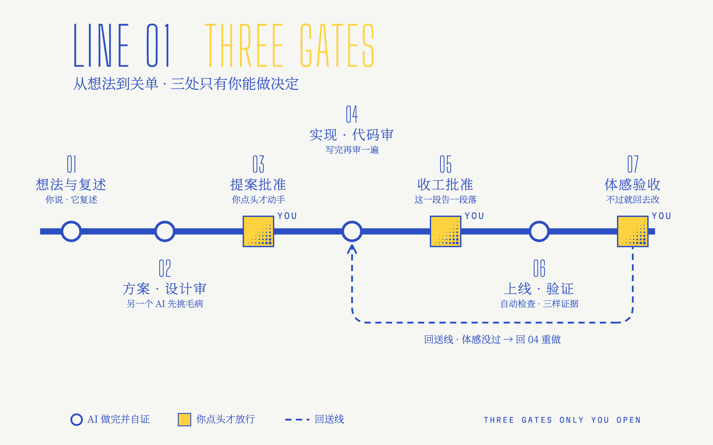

这张图的文字版(给 agent / 读屏)

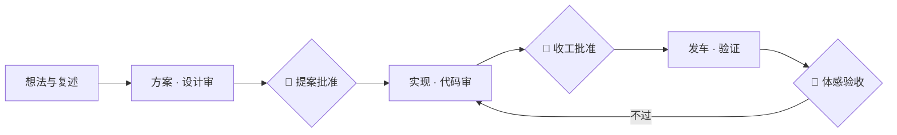

展开详细流程（给 agent / 想看细节的人）

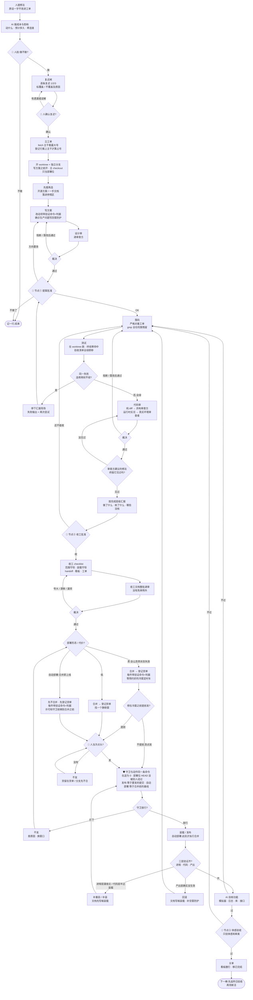

**怎么读**:主线从上往下走,顺序是「节点②批准 → 收工 checklist 与文档递审 → 合并 → 按部署形态发车 → AI 自核 → 节点③」(自动部署的项目:登记货单 → 当次许可 → 守卫 → 合并即发车)。三个 🚪 是人必须出现的地方——节点①决定「做不做、这么做行不行」,节点②决定「这一段能不能收」,节点③只验体感。中间每一个「裁决」菱形都至少有一条往回指的边:设计审打回方案、代码审打回落码、收工文档审打回 checklist、守卫拦下回到「部署形态」重新选窗口、三层验证分两种回退——进程层漏了宿主、代码层只装了一半,补重启 / 补装后重新过守卫;产出层确实没生效,回滚并回到落码。功能自核不过也回到落码。发车那一段分三档:冷窗是人预先约定的时机,货单拍过就按时发,想在冷窗之前提前发,就走「人当次点头」那条分支;静默窗每次都要人当次点头;自动部署因为合并就是上线,货单登记、许可和守卫都前移到合并之前。注意 `R2` 这个小菱形——审查方说「建议改成 X」之后,实现出来的终版必须再递一轮,很多人在这里断环。

---

## ② 单个执行棒的内部流程

这张图讲:一个执行棒接到派单后,自己从核查走到交货的全过程。

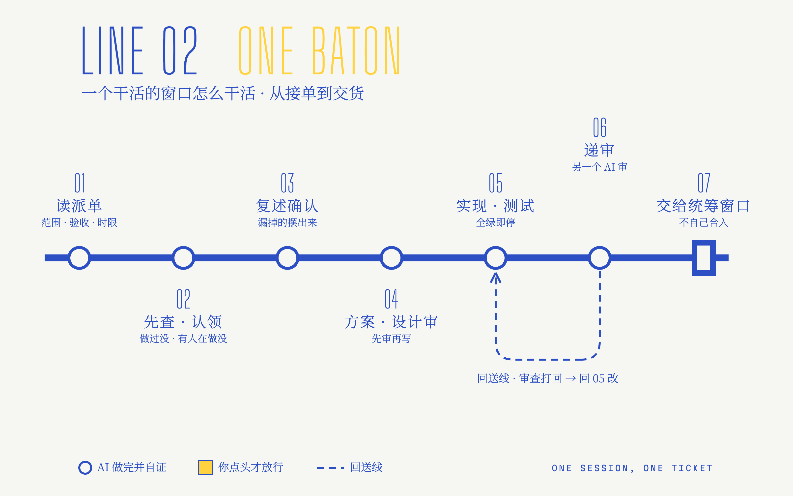

这张图的文字版(给 agent / 读屏)

展开详细流程（给 agent / 想看细节的人）

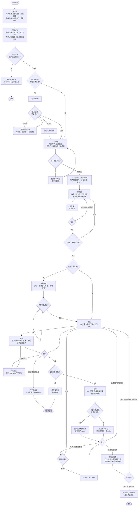

**怎么读**:这张图是「一个棒」的视角,统筹在图外。几个容易漏的地方:① 纠漂在最前面,很多活其实已经做完了;② 认领消息发出去不算认领,要等回执,等的时候只做无冲突的准备;③ 复述闸在写方案之前,不覆盖的项必须摆出来让人裁;复述确认后开 worktree(和图 ① 一样:写方案之前开);④ 方案要先过设计审,再由统筹 / 人确认,才开始实现;写生产数据要先报统筹;⑤ 测试红了有三种出口——绊线命中(钉写口)、普通红(回去改)、连修两轮还红(停下报);⑥ 审查方按对象选,判断有误要摆证据反驳,修法建议实现后要再审一轮;⑦ 交货后**不自己合入部署位**,由统筹合。

---

## ③ 总调度:多 session 统筹

这张图讲:总调度先汇报再派活,之后循环处理各棒发来的消息,并且独占合入和发布。

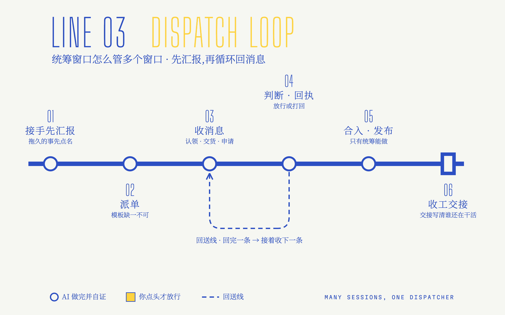

这张图的文字版(给 agent / 读屏)

展开详细流程（给 agent / 想看细节的人）

统筹的事分成两半:一半是**执行棒找上门的**(认领、单实例资源、生产数据写入、交货合入),一半是**统筹自己面对人和授权的**(出包发布、转述的授权、人的疑问句、收工交接)。分两张子图画,读起来不挤。

### ③-1 接棒、派单,以及执行棒发来的消息

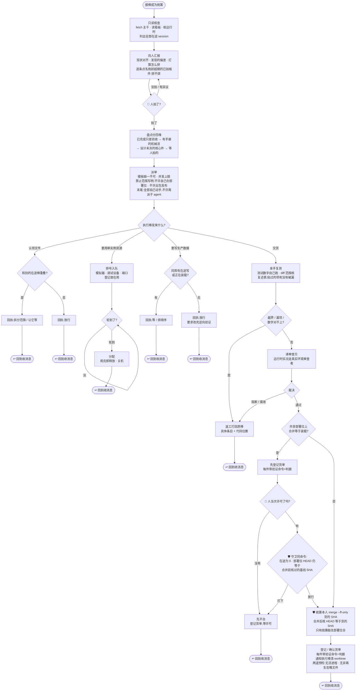

### ③-2 出包发布、授权的处理、收工交接

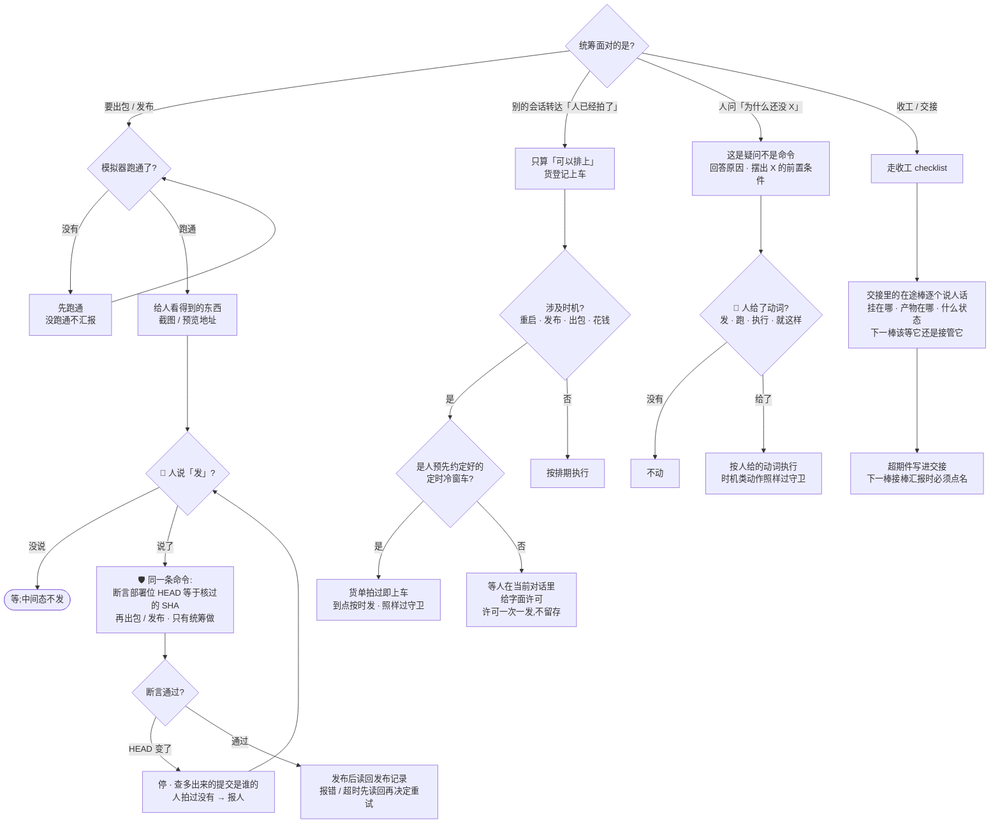

**怎么读**:③-1 里,统筹接棒后不干活,先汇报,而且汇报里必须点名超期件;之后它就是一个「收消息 → 判断 → 回执」的循环——「执行棒发来什么?」这个菱形是循环入口,每条分支末尾的「↩ 回到收消息」都表示回到这里。③-2 是统筹自己要过的几道关。注意三处 🛡:**只有统筹能往共享部署位合入、只有统筹能出包发布、发布命令里断言 HEAD**——这是多 session 不互相踩的物理保证。「转述的授权」那条分支最常出事:转述只授权「货可以上车」,时机要等人在当前对话里亲口说(唯一例外是人预先约定好的定时冷窗车)。

---

## ④ 部署 / 发布

这张图讲:按部署代价选窗口,拿到许可、过守卫后才装载,装上后按三层核实。

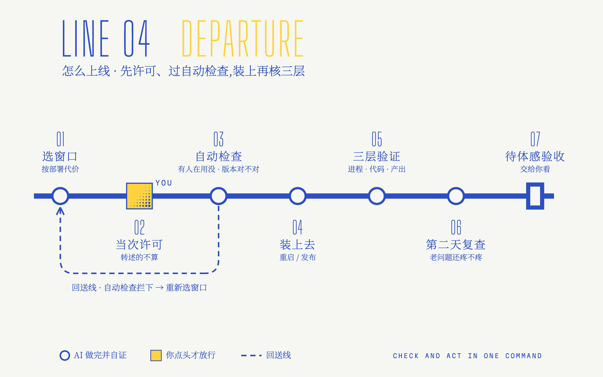

这张图的文字版(给 agent / 读屏)

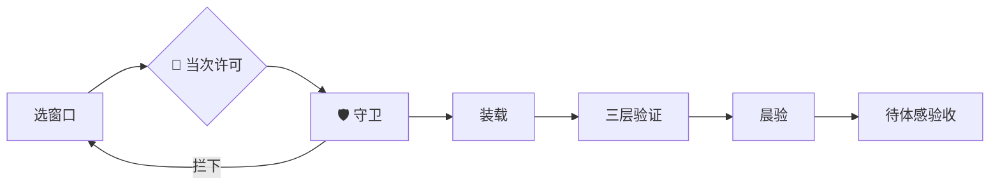

展开详细流程（给 agent / 想看细节的人）

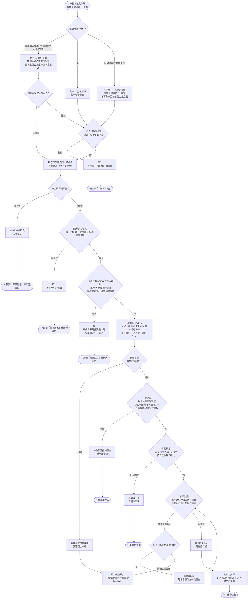

**怎么读**:「↩」开头的圆角框表示回到图里同名的那一步(为了不让回退线交叉成一团,没有画成长线)。先按部署形态和代价分三档:冷窗的时机是人预先约定过的,货单拍过就按时发,只有想提前发才要当次许可;静默窗每一次都要人当次许可;自动部署合并即上线,所以「先不合并、先登记货单」,许可和守卫都排在合并之前。守卫有三道,而且全部和动作写在同一条命令里:读不到数据就拦(fail-closed)、有在途就拦、HEAD 变了就拦。装上去之后按三层验证:进程层漏了宿主就补重启、代码层半边装载就补装或回滚、产出层没输出要先分清「还没自然发生」和「确实没生效」。任何回滚都要同时把文档改成「候装载」,如果修的是已确诊的生产问题,还要补空窗防护。

---

## ⑤ 踩坑以后怎么防复发

这张图讲:一次事故怎样变成一条再也不会被踩第二次的规则。

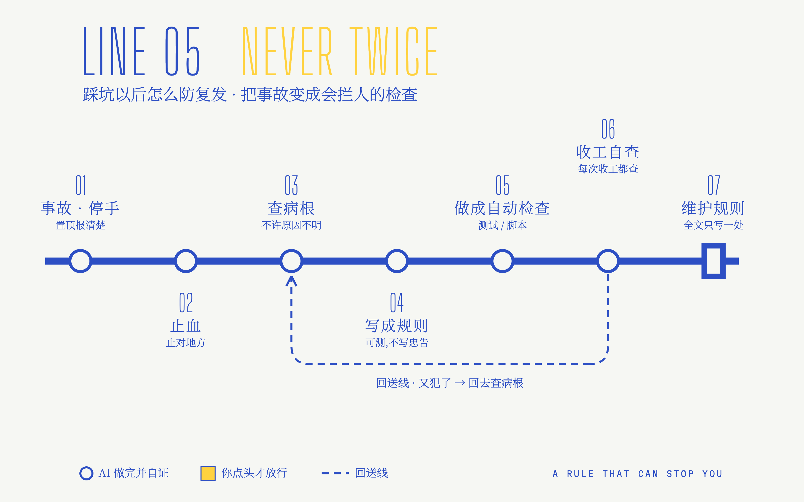

这张图的文字版(给 agent / 读屏)

展开详细流程（给 agent / 想看细节的人）

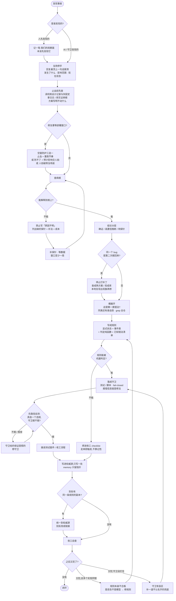

**怎么读**:这张图的终点不是「修好了」,而是「再也不会以同样的方式发生」。三处容易偷懒的地方:**止血前的三件事**(否则会把病挪到别处)、**解释不了就补探针**(不许以原因不明收尾)、**守卫的负路径自测**(假守卫比没有守卫更危险)。最下面两条回退边说明规则本身也会坏:多个实现在同一条规则上各错各的,说明规则写成了忠告;守卫没拦住,说明需要一道按结果判定、不认名字的兜底。

---

## ⑥ 收工

这张图讲:收工先自查范围和装载,再写文档、过守卫、整批递审,最后才提交。

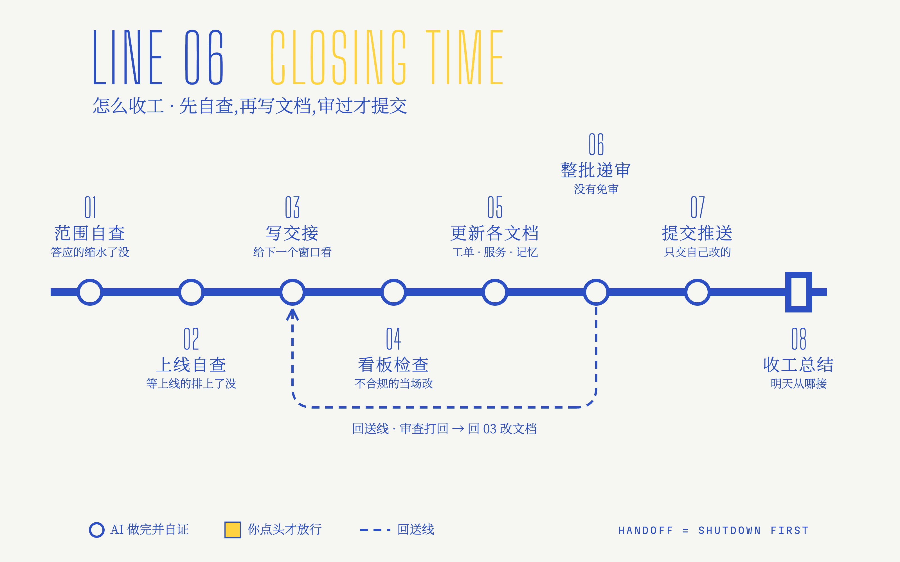

这张图的文字版(给 agent / 读屏)

展开详细流程（给 agent / 想看细节的人）

```mermaid
flowchart TD
    A(["人说「收工」<br/>或要交接给下一棒"]) --> B{"第 0 步 · 范围守恒<br/>今天有没有把拍过的范围<br/>切小 / 推迟 / 转二期?"}
    B -->|没有| C
    B -->|有| B1{"原因是物理原因?<br/>等部署窗口 · 外部依赖 · 等人在场"}
    B1 -->|是| B2["收工总结显性点名<br/>项 + 原因"]
    B2 --> C
    B1 -->|否:工作量大 / 先做核心| B3["违规<br/>恢复范围,或报人重新拍"]
    B3 --> B
    C{"第 0.5 步 · 装载守恒<br/>今天产生了候车货?"} -->|没有| D
    C -->|有| C1{"下一班车已挂?<br/>按确切任务名两处核"}
    C1 -->|已挂| C3
    C1 -->|没挂| C2{"挂得上?"}
    C2 -->|挂上| C3
    C2 -->|挂不上| C4["总结写:下一班无车<br/>货 X 顺延,原因 Y"]
    C4 --> C3
    C3{"文档里的「已装载 / 已生效」<br/>都有三层实据?"} -->|有缺| C5["改写成「候装载 / 候验证」<br/>或当场补验"]
    C5 --> D
    C3 -->|齐| D["第 1 步 · 写 handoff<br/>时间线 · 决策 · 范围守恒 · 完成层级<br/>验收两栏 · 在途棒说人话 · 超期件"]
    D --> E["第 2 步 · 看板四动作<br/>改 · 关 · 钉 · 量"]
    E --> E1["🛡 跑看板守卫<br/>worktree 里必须指定仓路径"]
    E1 --> E2{"硬失败项 > 0?<br/>trail · 删除线 · 超长行<br/>指针链 · 分区识别失败"}
    E2 -->|是| E3["当场修<br/>脚本批改:按段落限定<br/>断言只命中一处"]
    E3 --> E1
    E2 -->|全为 0| F["第 3 步 · 工单状态更新"]
    F --> G{"第 4 步 · 服务有增删 / 搬家 / 端口变?"}
    G -->|有| G1["改服务总览 + 服务文件"]
    G1 --> H
    G -->|没有| H{"第 5 步 · 结构 / 数据流 / 命名约定变了?"}
    H -->|变了| H1["更新架构文档对应区块"]
    H1 --> I
    H -->|没变| I["第 6 步 · memory<br/>教训写成 feedback · 同步改索引行"]
    I --> J["第 7 步 · 收工文档整批递审<br/>handoff + 看板改动 + 工单登记<br/>没有免审例外"]
    J --> K{"裁决"}
    K -->|数字不自洽 / 夸大 / 有副本 / 口径错| K1["改"]
    K1 --> J
    K -->|通过| L["第 8 步 · commit + push<br/>走 PR 的项目含合并<br/>自动部署项目:只 push 分支、不合并<br/>先 git status -s 核清单 · 只收本棒的改动"]
    L --> L1{"push 成功?"}
    L1 -->|失败| L2["不硬解<br/>汇报现场"]
    L2 --> M
    L1 -->|成功| M["第 9 步 · 收工总结<br/>做了什么 · 待体感验收项<br/>第 0 步点名项 · 车况 · 守卫输出 · 明天从哪接"]
    M --> N{"要交接给下一棒?"}
    N -->|是| N1["交接消息说人话<br/>在途棒逐个:挂在哪 · 产物在哪<br/>什么状态 · 等它还是接管它"]
    N1 --> Z(["结束"])
    N -->|否| Z
```

**怎么读**:第 0 步和第 0.5 步排在写 handoff 之前,是因为它们的结论要写进 handoff 和收工总结——先自查,再落笔。看板守卫是一个循环:硬失败项不清零就出不去。第 7 步递审排在第 8 步 push 之前,**先审、后推**;「纯文档」不是跳过它的理由。最后,交接不是另一套流程——交接 = 先走完这张图,再加一条说人话的交接消息。

