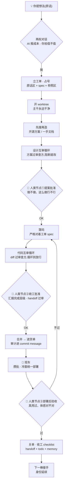

# idea-to-merge · 从一个想法到合并上线的全景

> [互审那套](workflow.md)讲的是「一段改动怎么被审到过」。这篇讲的是它外面那整圈:
> **一个想法从人嘴里说出来,到代码合并、部署、验收、交接,中间到底都走了哪些流程。**
>
> 这不是理论模板——是我们家一个真实项目(跑在一台 24/7 Mac mini 上的个人系统,
> 多个本地服务 + 定时任务 + 一个移动端 app,常年多 session 并行开发)每天在跑的东西。
> 每条规矩背后都是一次真实翻车;哪里踩的坑,文里直说。

---

## 0 · 全景图

**三个人类节点,名字分开记**(后文全按这套叫):

- **节点① 提案批准**——设计审过之后:做不做、这么做行不行。[七步循环](workflow.md)里的「闸门一」就是它。
- **节点② 收工批准**——代码审过、按完成层级汇报之后:这一段可以收、可以合并了。[七步循环](workflow.md)里的「闸门二」就是它(handoff 写完 + 过审,是这个里程碑的收尾动作)。
- **节点③ 部署后验收**——班车发车、真部署之后:人真用过一次,体感对,单才算关。七步循环停在节点②,因为它只管「改动怎么被审到过」;班车制(第 7 章)把部署从合并里拆了出来,于是多出这第三个节点——**合并 ≠ 部署 ≠ 验收过**,三件事三个时刻。

中间「设计互审 → 提案 → 落码 → 代码互审」那一段,就是[七步循环](workflow.md)。本文讲其余的一切,分三部:**Ⅰ 一个想法的一生**(单棒走完全程的主线)、**Ⅱ 规模化运行**(多 session 并行时的组织与额度)、**Ⅲ 让它长期活着**(文档与记忆)。

先约定几个词,后面全文通用:

- **CC** = Claude Code,做工方。
- **审查方** = 给 CC 的产出做 review 的那个 AI(Codex,或订阅内另一档模型)——见[七步循环](workflow.md)。
- **人 / 维护者** = 你,提想法和拍板的人。
- **棒** = 一个 Claude Code session。像接力棒——一棒做完交给下一棒,所以叫棒。
- **执行棒 / 总调度** = 干具体工单的 session / 统筹多个工单的 session(见第 9 章)。
- **子 agent** = CC 在自己会话里派出的临时子任务(见第 10 章,它和「棒」不是一个东西)。

---

# Ⅰ · 一个想法的一生

## 1 · 两权分立:需求判断权在人,成本估算权在 AI

一切流程的最上游,是一条**分权规矩**:

> **痛不痛、要不要做,人说了算;要动什么、花多少,AI 说了算。两权不混。**

具体说:

- 你提需求时,CC **可以**说:「这要动 X、改 Y、预计 N 小时」「会影响 Z 模块,要一起调」——这是它的专业判断,该说,说清楚是义务。
- 但 CC **不准**说:「我觉得这个点没那么痛」「不一定要改」「没必要」——痛不痛只有用的人知道。AI 对你的生活没有发言权,它只对代码的成本有发言权。
- 你听完成本,仍然要做,那就做。**不许再劝退第二次。**

**为什么值得钉成规矩**:这是人和 AI 结对里最常见、也最消耗感情的摩擦——你说想要个东西,AI 先给你泼三盆冷水。分权之后,对话里只剩事实:它报价,你拍板。讨论会变得非常快。

反过来这条也保护 AI 侧:它给出的成本估算你要当真。它说「这个改动会牵连三个模块」,那就是会牵连三个模块,不要用「应该没那么复杂吧」去砍它的工程判断。

## 2 · 节奏约束:两个极端都要钉死

AI 干活的节奏有两个典型失控方向,**而且互为反弹**——你只修一边,它必然弹向另一边。

### 失败模式 A · 推诿拆天

症状:明明一天能做完的活,被拆成「今天做一半,剩下明天」。尾巴过夜,第二天上下文冷了、优先级变了,尾巴就烂在那里。

对治规矩:

- **不需要观察的活,当天做完,禁止拆天。**
- 唯一合法的延期理由是「需要观察窗口」(比如要让它跑一晚上看数据)——且必须**提前报备**,不是拖到晚上补一句「明天继续」。

### 失败模式 B · 闷头狂奔

症状:领了个活,一口气跑一个半小时、烧几十万 token、中间零汇报。方向要是错了,就是全损——钱和时间一起。

对治规矩:

- **大活分段汇报**:每完成一个可验证的段落,停下来报一次,人确认方向再走下一段。
- **人催快 = 砍范围,不是加倍跑。** 这条反直觉但极重要:着急的时候正确动作是缩小交付,而不是更疯地烧。
- **动手前先写验收清单**(哪些测试要绿、哪些行为要证),测试的终点 = 清单全绿,**绿了就停**。清单之外「可能还要测测这个」= 上头信号,出现即停。
- **同一个失败连修两轮不绿 → 停下汇报**,带现场(失败输出 + 两次尝试),不许无限迭代。

### 方法论:约束要成对写

我们家真实走过这条弯路:先是嫌它拖,加了一条「别拖延」的约束——它立刻滑向另一个极端,一做东西就停不下来。

调 AI 的行为像调控制器:**单边约束必然过冲**。「别拖延」和「别乱跑」必须同时写,两端都钉死,中间留出来的才是正确行为区间。你在给自己的 AI 立规矩时,凡是节奏类的,都检查一下有没有只写了一边。

## 3 · 工单系统:原话、编号、参照

想法过了两权对话,第一站是**立工单**——一个 markdown 文件,格式见[工单模板](../templates/ticket.md)。除了互审流程需要的 spec(改什么/不改什么/怎么验),我们家的工单还有三样东西,都是被真实需求逼出来的。

### 3.1 原话区:人的原话,一字不改

工单的**第一个区块**永远是提需求的人的**原话**——微信里怎么说的、嘴里怎么念叨的,原样抄进去,不润色、不概括。AI 的转译(规范化的 spec)写在下面,**转译永远不许覆盖原话**。

为什么:转译必然丢意图。做着做着跑偏了、或者两周后回头看「当初到底要什么」,唯一可靠的锚就是原话。验收时对照的也是原话,不是 AI 自己写的验收标准——不然就是它自己出题自己判卷。

这是我们家坚持得最好的一条,强烈推荐。成本几乎为零,救回来的次数两只手数不完。

### 3.2 全局唯一编号 + 占号防撞

工单文件名带**全局唯一递增编号**(`工单_NN_短名.md`)。单人单线时这只是整洁;**多 session 并行时,编号就是锁**:

- 建号前先 `git fetch` 主干,看当前最大号;
- 建号后**立刻在看板登记一行、commit 推上主干——上了主干才算占到号**。

这条规矩来自一次真实三连撞:三个并行 session 同一天各自建单,撞出重号,事后合并对账很痛。「推上主干才算占号」之后再没撞过——git 天然是这个锁的仲裁者。

### 3.3 参照与关联区:溯源链

工单里固定留一个**参照与关联**区:

- **外部参照**:这单参考了哪个开源仓 / 教程 / 帖子——一行一条,链接 + license(若抄了代码)+ 用在哪。
- **关联工单**:和哪几单有依赖或渊源,编号互链。

为什么:「先搜再造」(第 5 章)搜来的东西,不落纸面就只存在于那一个 session 的脑子里。半年后回头看「当时为什么选这个方案、抄的谁」,顺着参照区就能摸到源头;新接手的棒也不用考古。**知识要有出处,关系要显式**——这和第 12 章的防烂原则是同一个精神。

## 4 · worktree 纪律:主干永远干净

git 层面一条铁律:

> **每一棒干活都在自己的 worktree 里,开独立分支;主 checkout 永远保持干净,只承担一个职责——部署位。**

- 开工:`git worktree add ../<repo>.worktrees/<棒名> -b <棒名>`,所有改动、所有 commit 都发生在 worktree 里。
- 收工:审过之后 rebase 主干、回主 checkout `merge --ff-only`、删 worktree。主 checkout 上只发生 ff 合并和部署动作,**永远不在它上面直接编辑**。
- git 写操作一律 `git -C <worktree路径>`,不 `cd` 进仓根再跑——cd 状态是隐形的,`-C` 每条命令自带路径,错不了。

**一个大多数人想不到的坑:跑测试也算破坏性动作。** 我们家真实规矩是「主 checkout 永不跑全量测试」——因为有些代码的状态文件路径是按**模块位置**定位的(`Path(__file__).parent / "data"`),和 cwd 无关,你在哪个目录跑都写的是主 checkout 里的**生产数据**。worktree 里没有那份数据,天然免疫。如果你的项目主 checkout 同时是运行时,这条直接抄走。

**接手必读顺序**也钉死(新 session 开工第一件事,顺序不许乱):

1. 项目说明(CLAUDE.md,自动加载)——红线和协作规范;
2. 服务总览(哪些东西在跑、端口、职责的权威表);
3. todo 看板——现在有什么单、什么状态;
4. 最近 1-2 份 handoff——上一棒做到哪、踩了什么坑;
5. 要接的那个工单文件本体。

读完这五样,一个全新的 session 就有了全局。这个顺序本身就是防漂设计:先读权威源,再读历史线索(handoff 排在 todo 之后,因为它是[真值层级](../conventions/truth-hierarchy.md)里更低的一层)。

## 5 · 方案 → 代码 → 互审

### 先搜再造

从零做一个功能,第一动作不是写码,是**广搜现有方案**:开源库、教程、别人的实现。别重复造轮子,也别对自己的智商过于自信。搜来的东西审慎判断、不盲从,同时正面想「有没有更优雅简便的路」。搜到什么、用了什么,**落进工单的参照区**(第 3.3 节)。

一个例外要想清楚:**管道可以抄,灵魂不外包。** 每个项目都有几个「它之所以是它」的核心文件(对我们家是几份核心 prompt)。基础设施尽管抄开源,那几个文件永远自己写——外包了它们,项目就不是你的项目了。

### 死胡同协议

卡死的时候(同一个问题绕了三圈没进展),两条出路,别硬磨:

1. **查一手资料**——注意是一手:官方文档、源码、跑命令直接验。二手结论(教程、论坛贴、甚至代码注释)都可能过期。我们家吃过一次大亏:一整份调研的六条结论全被推翻,起因就是引用了仓库里过期的注释当事实。
2. **拉另一个模型交叉讨论**——把「我们卡在哪、两边的论点」整理成一段,丢给一个不同血统的模型掰扯。它没有你们绕了三圈的思维定势,经常一眼看到墙上的门。

### 互审

设计和代码各过一轮异构互审,循环到放行——完整流程就是[七步循环](workflow.md),不重复讲。两个补充:

- **审查方不一定非是 Codex。** 同一订阅内跨档互审(旗舰做工、派另一档子 agent 当审查员)也成立——不产生新增账单,占的是包月额度(见第 11 章);损失一点「异构血统」的对抗性,换来低成本低摩擦。我们家的用法:大改动上 Codex(异构对抗最狠),日常小审用订阅内子 agent。
- **现在有官方插件了。** OpenAI 官方出了 [codex-plugin-cc](https://github.com/openai/codex-plugin-cc)(2026 年 3 月发布):在 Claude Code 里直接调 Codex 做 review 和任务委托,计费走 ChatGPT 订阅或 API key,用量计入 Codex 侧限额。和本仓手搓的 `codex exec` 是同一精神,集成更顺滑;手搓版的价值在于你能完全控制审查规约(AGENTS.md 那套)。两条路都通,按口味选。

## 6 · 红线:怎么让 AI「停下来问你」

用过 CC 的人都会好奇一件事:为什么它有时候会在合并、部署、删东西之前**自己停下来**等人点头?这不是玄学,是两层闸,各管一摊:

### 硬闸:harness 的权限系统

Claude Code 的 settings 里可以配 permissions,命令分三档:**allow**(免批直跑)、**ask**(弹窗要人按一下)、**deny**(直接拦死)。你平时看到的批准弹窗就是 ask 档在工作。这层是物理的——模型想绕也绕不过,适合钉「通用危险动作」:删文件、改系统配置、发布类命令。

### 软闸:写在必读文件里的纪律

「合并前先请示」「花钱先申请」「破坏性命令三确认」这些**不在 settings 里**——它们写在项目说明(CLAUDE.md)和 memory 里,靠模型自觉遵守。听起来不可靠?它能稳,靠三件事:

1. **写在必读位置**——项目说明每个 session 自动加载,不存在「没看到」;
2. **写得足够具体**——不是「要小心生产数据」,而是「路径含 `data/`、`db`、`vault` 任何一个,先停下问人」。模糊的规矩没有执行力,具体到能机械判断的规矩才有;
3. **违反必沉淀**——每次翻车,复盘写成一条新 memory(见第 13 章),下个 session 自动带着这条教训开工。规矩是活的,越用越密。

### 为什么两层都要

硬闸只认命令字符串,表达不了语境——「合并」本身不危险,「没请示的合并」才危险,这种判断只有软闸写得出来。所以配比是:**硬闸管通用危险命令,业务红线(合并、部署、花钱)靠软闸。**

软闸的具体条款,[通用红线](../conventions/redlines.md)里那三条(隔离分支 / 破坏性命令三确认 / 反轻描淡写)几乎人人适用,直接抄。再强调一句那边说过的:**好红线全部来自真实踩坑**。我们家最痛的一次:一条「先测一下」的随手命令,在错误的目录里清掉了生产库 1556 条数据——三确认协议就是那天晚上立的。别凭空想红线,痛过一次再钉,钉下去才有牙。

## 7 · 班车、验收、收工

### 合并 ≠ 部署:班车制

代码过了**节点②收工批准**、合并进主干后,**不立刻部署**。改动登记进一张「货单」,攒批,到每天固定的**冷窗**(凌晨的定时重启窗口)统一发车。

为什么:我们家的服务是 24/7 长跑的 LLM 应用,吃 **prompt cache** 吃得很重——重启一次,整条缓存冷掉,下一轮全量重写。cache 写入价是读取价的 **12.5–20 倍**(按缓存 TTL 档位,长 TTL 档更贵),白天随手一个「小重启」实际是一笔真实开销。而凌晨反正有一次计划内冷启动,变更蹭那一班车,**边际成本 ≈ 0**。

就算你的项目没有 cache 问题,班车制也值得抄,它换来三样:部署动作可预期(固定窗口,不会「随时可能重启」)、变更天然合批(一次验一车,不是一天验八次)、以及**发车纪律**——白天想临时发车,只认人**当场字面许可**;「交接单里说可以发」不算,**交接棒不是点火令**。这条是我们家踩过的坑:一个接棒 session 拿着交接消息里的「照单执行」当授权,白天重启了服务,砸掉整条热缓存。

### 验收闭环:部署完 ≠ 做完

班车发车后,还差最后一个人类节点——**节点③部署后验收**,对应[完成层级](../conventions/truth-hierarchy.md)的「用户体感已验证」层:**货到人验过,单才算关**。这恰恰是最容易烂掉的一环:收工时人已经困了,「明天再验」,然后明天被新想法淹没,尾巴一拖一周。

三个动作把它闭上:

1. **handoff 里验收项单独成区**(见[模板](../templates/handoff.md)):每项写清「验什么 + 怎么验 + 一步操作」。验收动作必须**傻瓜级**——打开某页看某处、点一下某按钮。要人手敲三条命令的验收,等于没写。
2. **看板上待验项挂牌**,验过即删。不验,它就一直在你眼前——遗忘变成不可能,只剩「拖着没验」这个可见状态。
3. **下一棒开工的固定动作:先追昨日验收,再领新活。** 把「昨天的货验了吗」从靠人记性,变成流程自动兜底。

### 收工 checklist

「收工」是个触发词——人说出口,CC 走一遍固定 checklist,不准跳步:

1. 写今天的 **handoff**(时间线 + 决策点 + 踩坑 + 待验收区 + 未完成项);
2. 刷 **todo 看板**(按第 12 章的规约:该重写的重写、该删的删);
3. 推进过的**工单文件**状态更新;
4. **服务表**同步(今天新增/搬家/下线了什么);
5. **架构文档**同步(结构变了才动,没变不动);
6. **memory** 同步(今天沉淀了什么教训);
7. 仓内改动 **commit + push**;
8. 给人一条**收工总结**:今天做了什么 / 待验收什么 / 明天从哪接。

一条铁律:**交接 = 先收工。** 要把活交给下一棒,必须先走完这套——handoff 只是第 1 步,不是全部。没走完 checklist 的交接 = 没交接,下一棒拿到的是一地散件。

---

# Ⅱ · 规模化运行:多棒并行

单棒走完上面的主线,小系统就够用了。当多个工单开始并行、多个 session 同时在跑,才需要这一部——组织怎么搭、额度怎么花。

## 8 · Skill 体系:把打法钉进文件,不靠每场重教

Claude Code 的 skill 机制:`.claude/skills/<name>/SKILL.md`,frontmatter 里写一段 description——**description 就是触发器**,描述里写清「什么时候用我」,匹配场景时 CC 自动加载全文。你不用每个 session 重新教一遍规矩,规矩自己长在仓库里。

我们家五个 skill,分两层 + 三个场景件:

### 底层:打法手册(所有 session 的第一站)

**任何** session 接手干活,第一站先读它——不管这棒是总调度还是执行棒。内容是「怎么干活」的全部纪律:接棒第一动作、工单生命周期每一步的规矩、跟人说话的格式、额度纪律。

它开头有一句定位,是整个体系的魂:

> 模型会换,工程师不换——读完这份,你就是那个工程师。

以及一条铁律:**skill 教打法,不教工程事实。** 手册里永远不写「现在有哪些服务、什么状态」这类快照——那些必然过期,一律链接到权威源让它自己查。手册只写不会过期的东西:纪律、顺序、格式、教训。

### 叠加:总调度打法(只有总调度棒读)

多工单统筹的那个 session 才触发:盘点、纠漂、派棒模板、验收环、对人汇报的格式(详见第 9 章)。执行棒不读它——执行棒不需要知道怎么派活,读了反而容易越权。

### 场景件三个

- **决策侧写**:维护者本人的工程决策偏好档案——什么时候要稳、什么时候要快、对哪类方案天然反感、说「先搞起来」时真实含义是什么。CC 在架构讨论、技术选型前查它,给出的选项就不会牛头不对马嘴。这相当于把「和这个人共事三个月才摸清的脾气」写成文件,每个新 session 出生即知。
- **设计规范**:动任何 UI/排版前必读的审美语言(什么风格算好、红线配色、禁忌)。设计审美是最难口头传递的东西,钉成文件后「做出来不像」的返工少了一个量级。
- **收工 checklist**:触发词是「收工」——听到就逐条执行一套固定动作,不准跳步(内容见第 7 章)。收尾恰恰是 AI 最容易「总落下这个那个」的环节,checklist 是对治。

两个骨架可直接抄走改用:[总调度骨架](../templates/skill-dispatcher.md) / [收工 checklist 骨架](../templates/skill-shutdown.md)(都是**骨架**——结构和纪律给全了,占位符按你项目填)。打法手册没有单独骨架——上面的描述加这两个骨架,足以拼出你自己的版本。

## 9 · 单干 vs 总调度:两种运行模式

### 单干模式

只有一个工单在做:一个 session 从想法陪到收工,走完第Ⅰ部的全程。小系统、单线任务,这就够了,别上总调度——多余的层级是纯开销。

### 总调度模式

多个工单要并行时,结构变成:**一个总调度棒长驻 + N 个执行棒**。人开好这些 session,想法只进总调度;执行棒对总调度汇报,总调度对人汇报。目标是:**人只在拍板点出现,搬话的活全部消灭。**

总调度的核心纪律,每条都是真实翻车换来的:

**接棒第一动作 = 汇报,不是干活。** 接手总调度后只做只读核查(fetch 主干、读工单、核运行时),核完先汇报「现状对齐了什么、发现哪些偏差、打算怎么排」,**人拍了才开工**。反例:某次接棒的 CC 拿着交接 prompt 闷头干完一整棒才露面——还抢了一个在途执行棒正在做的活,白干一场,险些撞车。另一半规矩:**你服务的对象是现在的人,不是上一棒**——交接 prompt 是上一棒的遗言,它和人现场说的任何一句冲突,以人为准。

**派单前先纠漂。** 看板说「待做」≠ 真待做。派单前先 `git log --grep` + 查运行时,核一遍这活是不是其实已经做完了。我们家有过一天撞出四起漂的记录(功能已上线一周、台账还写待做,照字面派单就是重复劳动)。判据永远是[真值层级](../conventions/truth-hierarchy.md):**代码/运行时 > 现状文档 > handoff**。

**派单模板,缺一不可**:工单号 / 目标一句话 / 必读权威文件 / 当前真实状态(纠漂后的) / 允许改的范围 / **禁止碰的范围** / 逐项可验的验收标准 / 停止条件 / **预计时长**(超时 = 停下报,不许继续磨) / 返回格式。末尾必加一句:「**全部自己动手,不许再派子 agent**」(理由见第 10 章)。

**验收环,每棒回报走一遍**:① 总调度亲手复测——测试数字自己跑出来,不信执行棒的转述;② diff 范围核——越界就返工;③ 递审查方过一轮互审;④ **返工打回原棒**(它上下文还热,重开新棒等于重付一遍装载费),返工消息带具体条目和代码位置,不许说「再检查一下」这种没法执行的话。

**对人只报拍板题。** 人只拍五类:要不要 / 往哪走 / 像不像 / 花不花钱 / 碰没碰红线。排期、工序、派棒时机是总调度自己的职责,**直接定 + 告知**,不许抛回给人——给人的消息里出现「你看什么时候做?」就是失职信号。

### 跨 session 的规矩

- 动共享文件前先向其他在途 session 打招呼认领;**发消息 ≠ 认领成功,收到回执确认无撞才动手**——消息可能根本没被读到。
- 契约中途变更,立刻通知受影响的棒,别等它做完再返工。
- **在途棒正在做的活,总调度不许亲自上手重复做。** 要改方向就发消息;等不及就先停掉那个棒再接手——绝不双线改同一批文件。

## 10 · 子 session ≠ 子 agent:一字之差,额度天壤

这两个东西经常被混为一谈,但从生命周期到计费都完全不同:

| | 执行棒(子 session) | 子 agent |
|---|---|---|
| 是什么 | 独立的 Claude Code 会话 | 会话内派出的临时子任务 |
| 上下文 | 自己完整的一套,随会话持续积累 | 不带主会话的对话历史,**也不带 memory**;项目说明(CLAUDE.md 层级)重新装载一遍 |
| 工作区 | 自己的 worktree、自己的分支 | 在派它的会话的环境里跑 |
| 生命周期 | 可以跨小时、跨天,可以交接 | 活干完即散,结果只回给派它的人 |
| 适合 | 独立工单、需要「接力」的活 | 机械活:全仓扫描、批量改动、跑测试、审查二审 |

判断口诀:**这活需要独立生命周期吗?** 需要(明天还要接着做、要交接给下一棒)→ 执行棒;不需要(一次跑完出结果)→ 子 agent。

一个容易想当然的细节:**memory 不随子 agent 走**(官方行为:子 agent 只装载项目说明,不装载主会话的 memory)。你沉淀在 memory 里的红线和教训,派出去的子 agent 并不知道——要它遵守的规矩,写进项目说明,或者直接写进派单 prompt。

### ⚠️ 额度陷阱:子 agent 默认继承主会话的模型

这条最容易被忽视、也最烧钱:**子 agent 不指定模型时,继承派它的会话正在用的模型。** 总调度用旗舰模型时,随手一句「派个 agent 帮我全仓扫一下」——那个纯机械的 grep 活,就在按旗舰档消耗你的额度,和总调度本人一个价。

规矩:**派子 agent 必须显式指定模型档位。** 机械活指定最小档,执行类指定中档;只有真需要判断力的活才允许它继承。(模型分档见第 11 章。)

### 额度经济学(所有棒适用)

心法一句:**上下文是钱。派一个 agent = 把项目级上下文重新装载一遍,这笔钱只为「你自己做明显更慢的活」花。**

- **五分钟能自己核清的,绝不派 agent。** 纠漂、查证据、翻日志 = 主会话自己 grep 自己读。派 agent 查证据最亏:烧了装载费,拿回来的还是二手结论,关键处你还得自己复核。
- **小债合订**:同仓/同域的小活打包成一棒,不许一债一棒——一债一棒等于每笔债重付一次装载费。
- **返工打回原棒**,不重开:原棒上下文还热,新棒要从零装载。
- **并发设上限**(我们家:2 个执行 + 1 个轻查——轻查 = 只做只读查证的轻量棒),每单预算 = 1 执行 + 1 返工 + 1 收口小修,要超先停下报。
- **禁止孙代**:派出去的 agent 不许再派自己的子 agent。我们家真实事故:一个测试棒偷偷派了孙代,僵尸任务卡挂 11 小时,祖父会话根本停不掉它。所以派单 prompt 末尾永远带那句「全部自己动手」。

## 11 · 模型调配:三档分工

订阅额度是有限资源,模型按「这活需要多少判断力」分三档:

| 档位 | 干什么 | 例子 |
|---|---|---|
| **旗舰**(最贵最紧) | 判断密集的活 | 总调度、根因分析、架构设计、要品味的文案 |
| **主力** | 执行棒的实现活 | 按 spec 写码、修 bug、写测试 |
| **小模型** | 机械棒 | 批量扫描、清单式改动、格式化整理 |

三条注意:

- **旗舰不干搬运活。** 让旗舰模型跑 grep、贴文件,是这个体系里最贵的浪费(结合第 10 章的继承陷阱——这种浪费经常是默认发生的,你根本没批过)。
- **小模型的关键结论必须自己复核**——它们省钱,但它们会编。拿 commit / 运行时去核,别直接信。
- **每个 session 第一条回复自报当前模型。** 手机上看不到状态栏,不自报你就不知道自己正在跟哪个档位说话、烧哪份额度。一句话的事,防大钱。

### 两条省钱铁律

**① 审查/二审走订阅内子 agent,不烧裸 API。** 需要第二双眼睛时,派一个订阅内的子 agent(指定另一档模型)去审——订阅内**不产生新增账单**(占的是包月额度池,额度本身仍有限,别无脑挥霍);而拿裸 API 调模型是真金白银按 token 计费。我们家为这条交过学费:一次二审图省事走了裸 API,几轮下来烧掉 ¥4-5——同样的活走订阅子 agent,一分钱账单都不会多。立下的家规:**任何会按量计费的动作,先申请再动;订阅内的活,在额度纪律内随便跑。**

**② 工具活外包给便宜模型。** 翻译、语种检测、分类打标这类无判断含量的调用,接一个便宜的外部 API(几分之一的价格),别用主力模型的额度去干。

---

# Ⅲ · 让它长期活着

## 12 · 文档怎么不烂掉

工单、handoff、todo 这些流程文件,都有同一个宿命:**越写越多、越多越漂、最后没人信**。我们家的看板一度膨胀到 190KB——是的,一个 todo 文件,190KB。后来立规约清到 18KB(-91%),并且再没胖回去。核心认知:

> **文档烂掉不是勤快问题,是结构问题。只要「追加」是默认动作,文档必然烂;把默认动作换成「替换 + 删除」,它就烂不起来。**

### 单一权威源(SSOT)

**同一个事实,只允许有一个权威源;别处一律链接过去。** 发现自己要在两个文件里改同一件事 = 屎山信号,立刻停下,把其中一处改成链接。每类事实指定权威:服务/端口 → 服务总览表;工单状态 → 工单文件本身;架构 → 架构文档。看板行、handoff 提到时,一律链接不复述。

### todo:看板不是史书

todo 只回答一个问题:「**现在什么状态,下一步是什么**」。历史归 handoff,细节归工单文件。写入规则:

- **更新 = 整条重写当前态。** 新状态**替换**旧状态,被取代的文字直接删——不划删除线、不留日期链、不用「→」堆演化史。演化史 git 都记着,不需要文档自己背。
- **完成 = 删行**(移一行到已完结表)。做完的事在看板上多留一天,就稀释一天注意力。
- **临时性内容自带删除条件**:在途 session 的挂牌行「收工即删」;发车货单「验收后即删」;欠账台账「做完删行,拖龄超 3 天收工点名」。**每一行生下来就注定要死**,这是看板保持 18KB 的全部秘密。
- **禁止写入清单**:交接摘要、调查过程、方案讨论、commit 列表、任何「留档」——这些各有各的家(handoff/工单/git log),进看板就是垃圾。
- 收工跑一个**守卫脚本**量化行数/体积,数据可见,膨胀趋势当场暴露。

### handoff:单一入口 + 月度归档

- **活区只留当月**,更早的移进归档区(进去即冻结,只查不改)。
- 找「最新交接」只有一个动作:**按文件名日期取最新那份**。不需要目录、不需要索引——唯一入口本身就是防漂。
- handoff 是**历史线索,不是现状事实**(真值层级里它排在代码、现状文档之后)。下一棒读它知道「上一棒做到哪、为什么」,关键事实回代码和运行时核,不照抄。

### 归档前查运行时依赖

移动/改名任何文档前,先 grep 代码里有没有脚本在读它。我们家真实事故:一个工单完结归档,第二天一个定时任务断粮——它每天要读那份工单里的一个章节。**工单完结 ≠ 文件可以挪。**

## 13 · 记忆与身份:换模型也换不掉的工程师

最后一块拼图:**session 会结束,模型会换代,凭什么这套流程不散?**

### memory:一事一文件

Claude Code 有持久 memory 目录,我们家的用法:

- **一条事实 = 一个文件**,带一行 description;一个 `MEMORY.md` 索引,每条一行,session 启动自动加载索引,按需读全文。
- 最值钱的类型是 **feedback**:每次翻车、每次被纠正,复盘写成一条——**是什么 + 为什么 + 下次怎么做**。它不是日记,是补丁:下个 session 自动带着这条教训开工,同一个坑不踩第二次。
- 一条元规矩:**memory 是启动提示,不是又一套真相。** 服务状态、架构现状这些会变的事实,memory 里只留指针指向权威源,不留可以独立漂移的副本——否则 memory 自己就成了第 12 章要治的那种烂文档。

### 身份:信流程,不是信某个模型

打法手册开头那句话值得再抄一遍:

> **模型会换,工程师不换——读完这份,你就是那个工程师。**

「那个工程师」不是某个模型版本,而是 **打法手册 + memory + 文档体系** 的总和。真实发生过的场景:底层模型换代当天,新模型开一个 session,读完手册和 memory,直接接棒干活——手法、规矩、对人的了解,全部延续,像同一个人换了台电脑。

这也是整套体系最后落脚的地方:**对 AI 的信任,从「信这个模型」换成「信这套流程」。** 模型是会换的、会犯错的、会失忆的;流程是攒出来的、结痂的、只增不减的。你花在立规矩、写 skill、沉淀 memory 上的每一分钟,都在给下一个 session、下一个模型、下一年的自己存钱。

纪律就是结痂的疤。照着走,你会比我们少疼很多。
