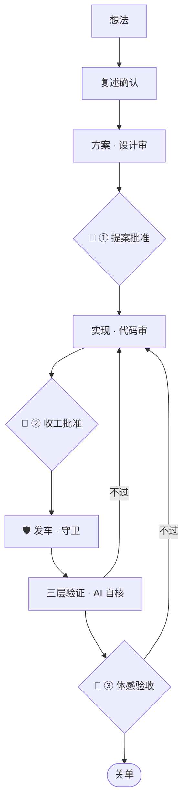
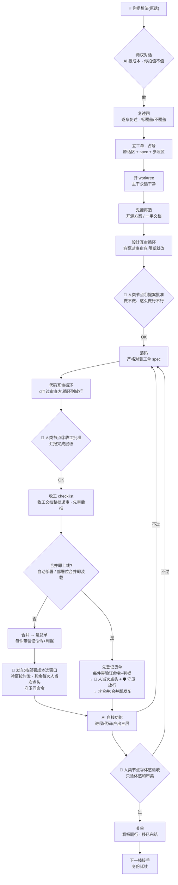

# 参考:标签、词表、全景图

> 这一页是[进阶手册](idea-to-merge.md)的附录:规则标签怎么看、文中的日常用词是什么意思、整条线的全景图。不用先读完——正文里第一次出现这些词的地方,都会链到这里。新手先看[新手入门](beginner.md)。

## 怎么用这个仓

**这是一个规则库,不是一套必须整包安装的框架。** 我们家的项目长到今天,规矩是一条条疼出来的;你的项目不一定有同样的地形,所以别照单全收——**留用哪些,你按自己的情况挑。**

为了好挑,[进阶手册](idea-to-merge.md)的规则都按「独立成块」写:每条单独讲清**规则 + 为什么(一句事故教训)+ 怎么落地**,不依赖读过前文;每条开头标一个或几个**适用前提**标签。你对照下面这张表,看看自己的项目有哪些前提,只拿带这些标签的条目:

| 标签 | 什么时候你才需要 |
|---|---|
| `通用` | 只要你在和 AI 结对写代码,都值得考虑 |
| `多 session` | 同一时间有两个以上 AI 会话在改同一批仓库 |
| `有部署` | 代码合并后还要「装上去」才生效(重启服务、发热更新、跑迁移) |
| `有自动部署` | 合并本身就会触发上线(CI 自动发布,或者主 checkout 就是运行目录) |
| `有长驻服务` | 有 24/7 跑着、重启会打断在途请求的进程 |
| `有生产数据` | 有一份真实数据库 / 数据目录,写坏了无法从 git 恢复 |
| `有测试套件` | 有一套自动化测试,并且会在多个工作目录里跑 |
| `有审查方` | 你给 AI 配了另一个 AI 做 review(见[互审专题](workflow.md)) |
| `有 AI 工具面` | 你在给某个 AI 助手定义工具(tool / function calling),工具描述会进它的上下文 |

几条使用建议:

- **从 `通用` 起步。** 第 1–7 章的主线 + 第 15 章里标 `通用` 的条目,单人单线就够用。
- **等疼了再加。** 带前提标签的条目,在你还没遇到那个前提时就是纯开销。比如没有长驻服务,就别抄「重启前查在途流量」。
- **抄结构,别抄数字。** 文中的阈值(300 字符、8 条、3 天、120 秒……)是我们家调出来的,你的项目按自己的数据定。
- **规则要有牙。** 抄走的规则,能落成会拦人的代码就落成代码([第 14 章](idea-to-merge.md#14--踩坑以后怎么防复发)讲怎么做);只停留在文字里的规则,迟早被一个赶时间的 session 绕过去。

[进阶手册](idea-to-merge.md)的章节地图:

- **Ⅰ 一个想法的一生**(第 1–7 章):单棒从想法走到关单的主线。
- **Ⅱ 规模化运行**(第 8–11 章):多 session 并行时的组织与额度。
- **Ⅲ 让它长期活着**(第 12–14 章):文档、记忆,以及**踩坑以后怎么防复发**。
- **Ⅳ 规则库**(第 15 章):A1–A16 十六条独立规则,每条带标签,按需取用。
- **流程图**:六组详细流程图(总览 / 单棒内部 / 总调度统筹 / 部署发布 / 防复发闭环 / 收工)单独放在 [`flowcharts.md`](flowcharts.md)。

## 三个人类节点

- **节点① 提案批准**——设计审过之后:做不做、这么做行不行。[七步循环](workflow.md)里的「闸门一」就是它。
- **节点② 收工批准**——代码审过、按完成层级汇报之后:这一段可以收、可以合并了。[七步循环](workflow.md)里的「闸门二」就是它(收工文档——handoff、看板、工单——写完并整批过审,是这个里程碑的收尾动作)。
- **节点③ 体感验收**——部署之后:**功能对不对由 AI 自己证明**([第 7.2 节](idea-to-merge.md#72-验收功能由-ai-自己证明人只验体感)),人只验 AI 验不了的那部分——体感、审美、像不像。七步循环停在节点②,因为它只管「改动怎么被审到过」;部署从合并里拆出来之后([第 7.1 节](idea-to-merge.md#71-合并--部署按部署成本选窗口)),多出这第三个节点——**合并 ≠ 部署 ≠ 验收过**,三件事三个时刻。

中间「设计互审 → 提案 → 落码 → 代码互审」那一段,就是[七步循环](workflow.md)。[进阶手册](idea-to-merge.md)讲其余的一切。

## 词表

### CC

Claude Code,做工方。

### 审查方

给 CC 的产出做 review 的那个 AI(Codex,或订阅内另一档模型)——见[七步循环](workflow.md)。

### 人、维护者

你,提想法和拍板的人。

### 棒

一个 Claude Code session。像接力棒——一棒做完交给下一棒,所以叫棒。

### 执行棒、总调度

干具体工单的 session / 统筹多个工单的 session(见[第 9 章](idea-to-merge.md#9--单干-vs-总调度两种运行模式))。

### 子 agent

CC 在自己会话里派出的临时子任务(见[第 10 章](idea-to-merge.md#10--子-session--子-agent一字之差额度天壤),它和「棒」不是一个东西)。

### 拍板

人做出明确的决定(要不要做、往哪走、能不能发)。人「问了一句」不等于拍板

### 刀

一个工单拆成的一次可独立交付、可独立验收的改动。「第 3 刀」= 这个工单的第三段改动

### 灵魂件

决定这个项目「之所以是它」的核心文件(比如核心 prompt、核心文案)。只能由人拍、由主会话亲手改,不外包给子 agent 或小模型

### 纠漂

派活前核一遍「看板说待做的事,是不是其实已经做完了 / 状态已经变了」,以代码和运行时为准

### 部署位

承担运行或发布职责的那个主 checkout。只在这里做合并和部署,不在这里编辑

### 发车、货单、候车货

一次部署 / 登记待部署改动的清单 / 合了主干、等着被部署的改动([第 7.1 节](idea-to-merge.md#71-合并--部署按部署成本选窗口))

### 冷窗、静默窗

预先约定的低峰期定时部署窗口 / 守卫确认零在途请求的任意空档([第 7.1 节](idea-to-merge.md#71-合并--部署按部署成本选窗口))

### 装载

把合并好的代码真正让运行中的服务用上(重启进程、热更新等)。「已装载」= 进程层 + 代码层实据齐;「已生效」= 再加产出层([A3](idea-to-merge.md#a3--装载三层验证--收工装载守恒))

### 钉货 SHA

货单上为每个仓记下的「这次要装上去的确切提交」。装载后逐仓核 HEAD 是否等于它

### 晨验

部署第二天(或部署后第一时间)的固定核查:三层装载实据 + 每个已知问题的「病人项」

### 病人项

晨验里针对每个已知在产问题查的一条生产实据:过去 24 小时它还疼不疼

### 守卫

会拦人的检查:脚本、测试或命令模板,不满足条件就让动作发生不了([第 14 章](idea-to-merge.md#14--踩坑以后怎么防复发))

### 写口、绊线

代码里会写文件 / 写库的位置 / 测试里专门抓「测试写到了不该写的地方」的检查([第 14 章守卫 2](idea-to-merge.md#守卫-2--测试写入绊线))

### 欠账台账、拖龄

看板上「拍过但还没做」的清单 / 一件欠账从拍板到现在拖了多少天

### 轻查

只做只读查证、不改代码的轻量棒

### 收口

一个工单最后的小修和收尾,让它可以关单

## 全景图

主干一眼看完:

展开详细一点的全景图（给 agent / 想看细节的人）

再往下的完整版(带全部审查环、回退边和判断条件)见 [流程图](flowcharts.md) 的图 ①。

